# Hardware Accelerator for SHA-256 Hashing Algorithm

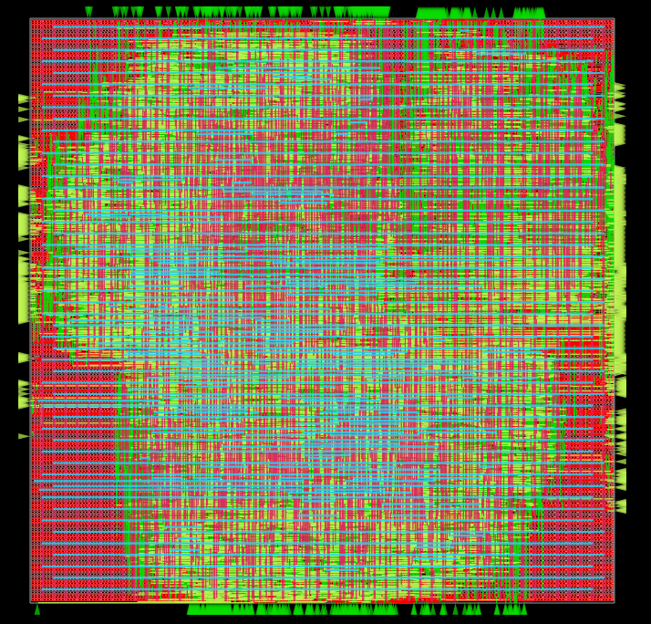  
*Figure 1: Final layout of the SHA-256 hardware accelerator showing placement and routing*

## Project Overview
- **Objective**: Design a hardware accelerator for SHA-256 hashing interfaced with PicoRV32 CPU via AXI4
- **Motivation**: Achieve high-throughput and low-latency hashing for secure applications (e.g., banking, email)
- **Approach**: Iterative improvements through spatial pre-computation, unrolling, and pipelining techniques

## SHA-256 Algorithm
1. **Padding and Parsing**: Adjusts input message to a multiple of 512 bits
2. **Message Expansion**: Splits input into 16 blocks (32 bits each), expands to 64 blocks
3. **Block Compression**: Processes 64 iterations on 8 variables with expanded blocks and constants
4. **Hash Output**: Combines 8 variables into a 256-bit hash value

## Implementation Details

### Base Implementation
- **Architecture**: 4-stage pipelined design
- **Critical Path**: Variables `a` and `e` computation with 4 adder stages
- **Performance**: Requires 66 clock cycles per hash computation

### Optimizations
- **Two-Unrolling**: Direct computation of `a_{t+2}` from `a_t`, reducing cycles to 34
- **Two-Unrolling + Pipelining**: Splits block compression into two pipelined stages (35 cycles)
- **Improvement**: Nearly 90% faster than base implementation

## Configuration
- **Platform**: sky130hd
- **Design**: sha256_unrolled_pipelined
- **Synthesis**: Flat synthesis, resource sharing enabled
- **Floorplanning**: 45% core utilization, 1.0 aspect ratio
- **Placement**: 0.6 density, timing and routability driven
- **CTS**: 15um buffer distance, 0.5pF max capacitance, max cluster size = 10, max cluster diameter = 10um
- **Routing**: 0.3 congestion adjustment, 10 antenna iterations
- **Timing**: 10ns clock period, single-corner STA

## Clock Tree Synthesis Optimizations
| Configuration | Cluster Size | Cluster Diameter | Buffer Distance | Buffer Size |
|---------------|-------------|------------------|----------------|------------|
| cts-1-1 (base)| 50          | 20               | 20             | BUFX4 & BUFX8 |
| cts-1-2       | 25          | 10               | 20             | BUFX4 & BUFX8 |
| cts-1-3       | 10          | 10               | 15             | BUFX4 & BUFX8 |
| cts-2         | 8           | 10               | 10             | BUFX4 & BUFX8 |
| cts-3         | 8           | 7                | 7              | BUFX4 & BUFX8 |

## Results

### Key Metrics
- **IR Drop Analysis**:
  - VDD: Worst-case 32.8mV (1.82%)
  - VSS: Worst-case 39.6mV (2.20%)
- **Design Area**: 270600 μm², 57% utilization

### Cell Type Report
| Cell Type            | Count | Area (μm²) |
|----------------------|-------|------------|
| Antenna cell         | 160   | 400.38     |
| Clock buffer         | 411   | 8907.29    |
| Timing Repair Buffer | 1117  | 10891.70   |
| Inverter             | 658   | 2690.08    |
| Clock inverter       | 204   | 2016.93    |
| Sequential cell      | 2787  | 79277.28   |
| Combinational cell   | 11781 | 158439.46  |
| **Total**            | 17118 | 262623.13  |

## Visualizations

### Comparison Graphs
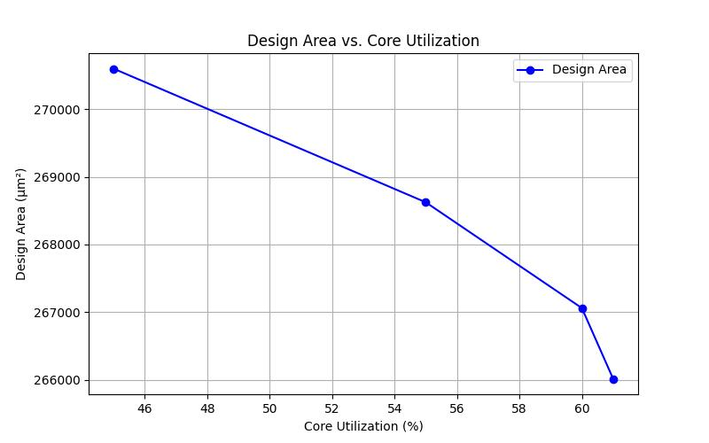  
*Figure 2: Design area versus core utilization across different implementations*

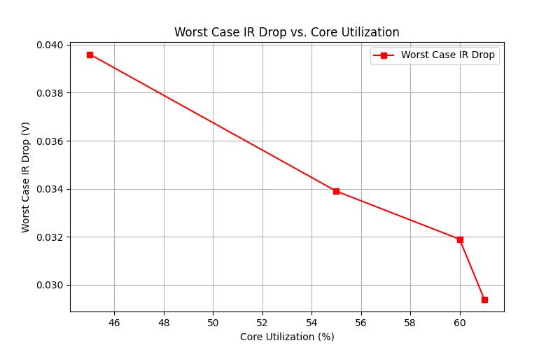  
*Figure 3: Worst case IR drop versus core utilization*

### CTS Optimizations
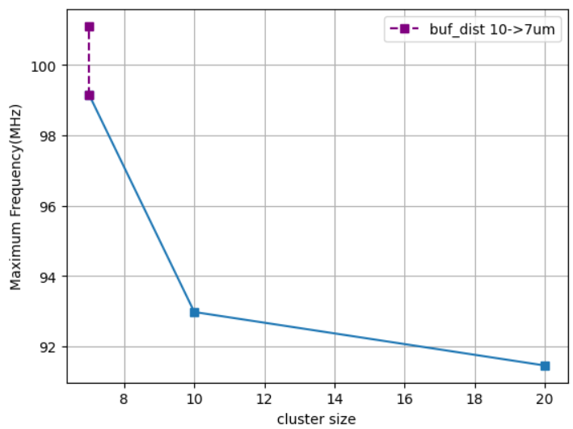  
*Figure 4: Maximum achievable frequency for different clock tree cluster sizes*

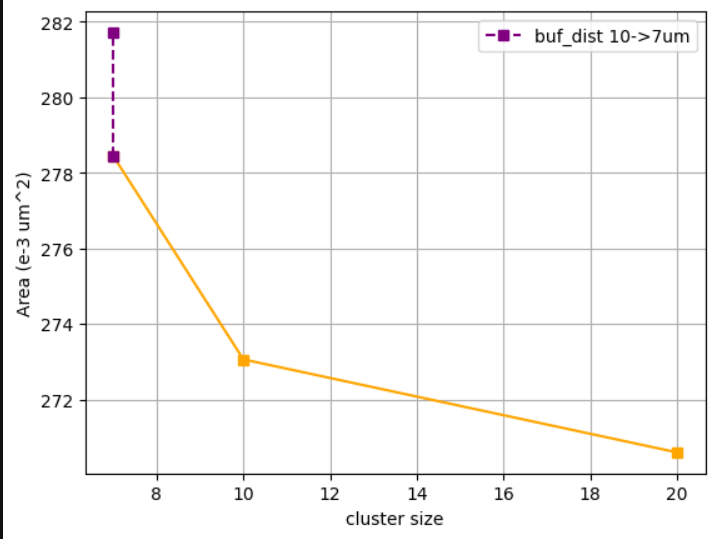  
*Figure 5: Impact of cluster size on total design area*

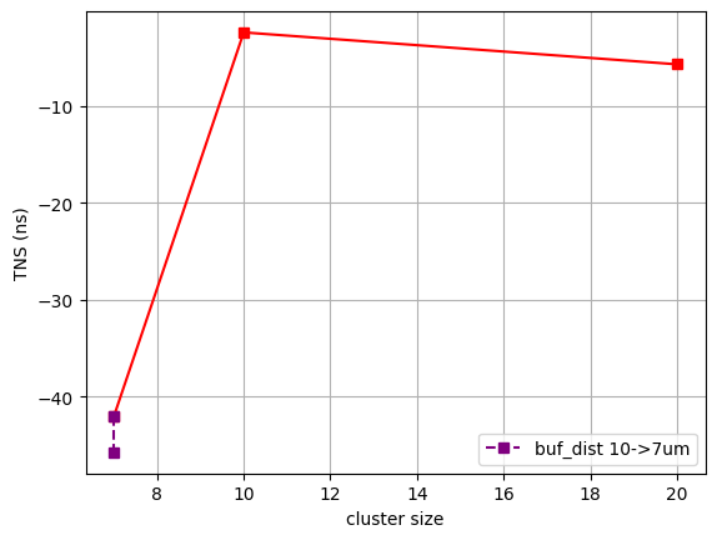  
*Figure 6: Timing performance (TNS) across different cluster configurations*

  
*Figure 7: Power consumption trends with varying cluster sizes*

### Layout Parameters
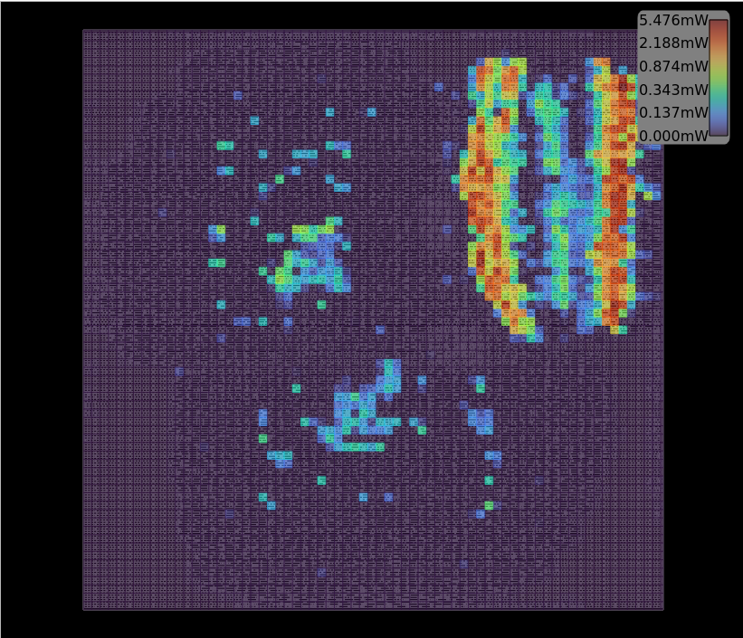  
*Figure 8: Power density heatmap across the chip layout*

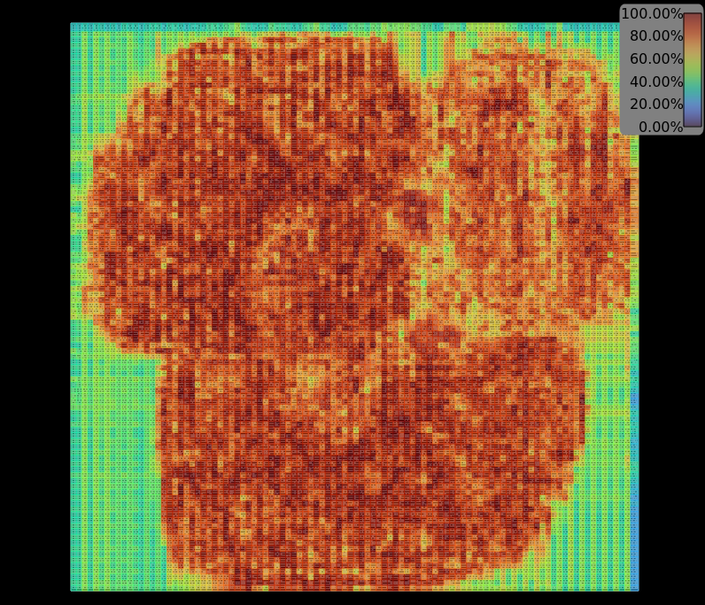  
*Figure 9: Visualization of routing congestion in the design*

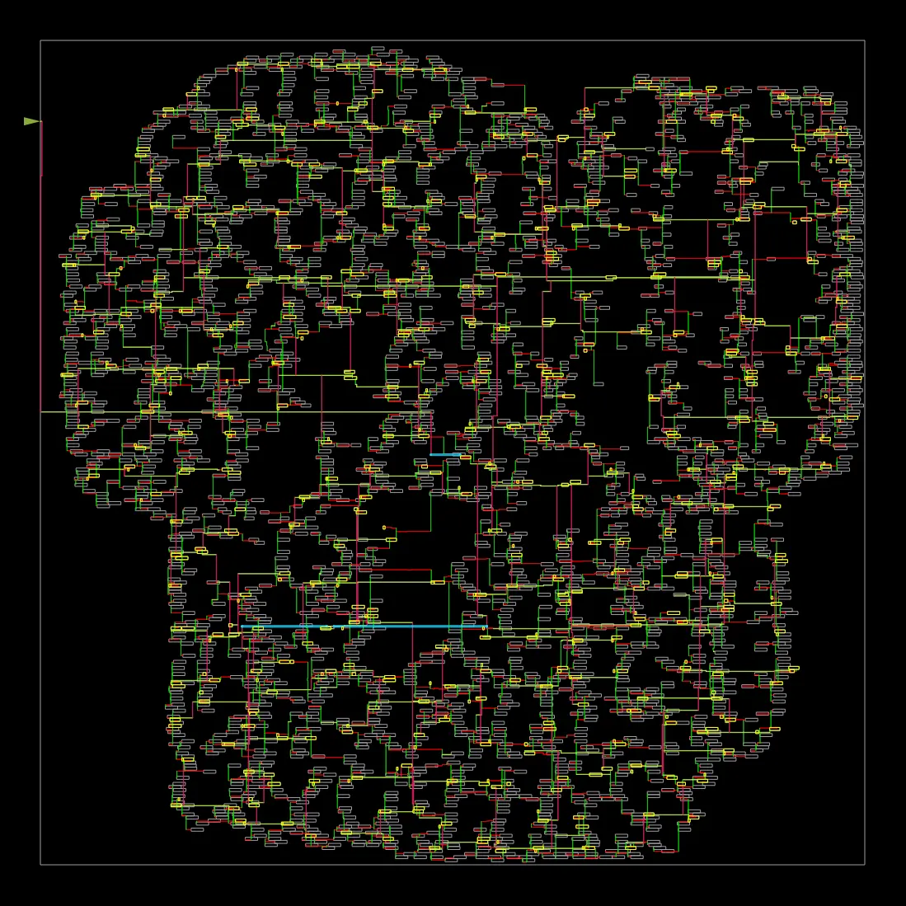  
*Figure 10: Clock tree synthesis results showing clock distribution network*

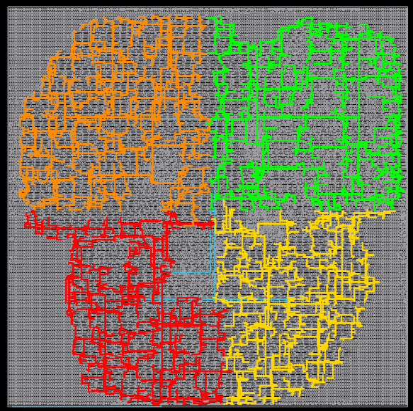  
*Figure 11: Clock tree regions and buffer placement*

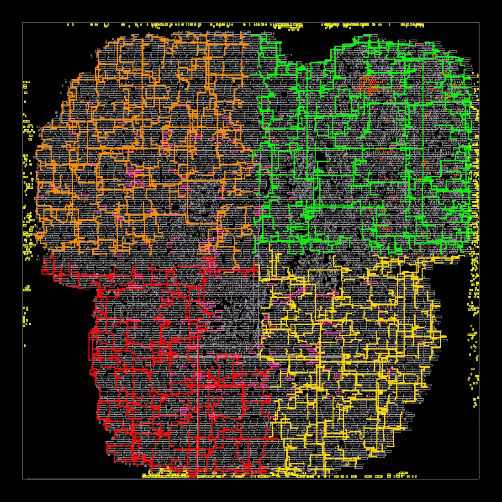  
*Figure 12: Cell placement after resizing optimization*

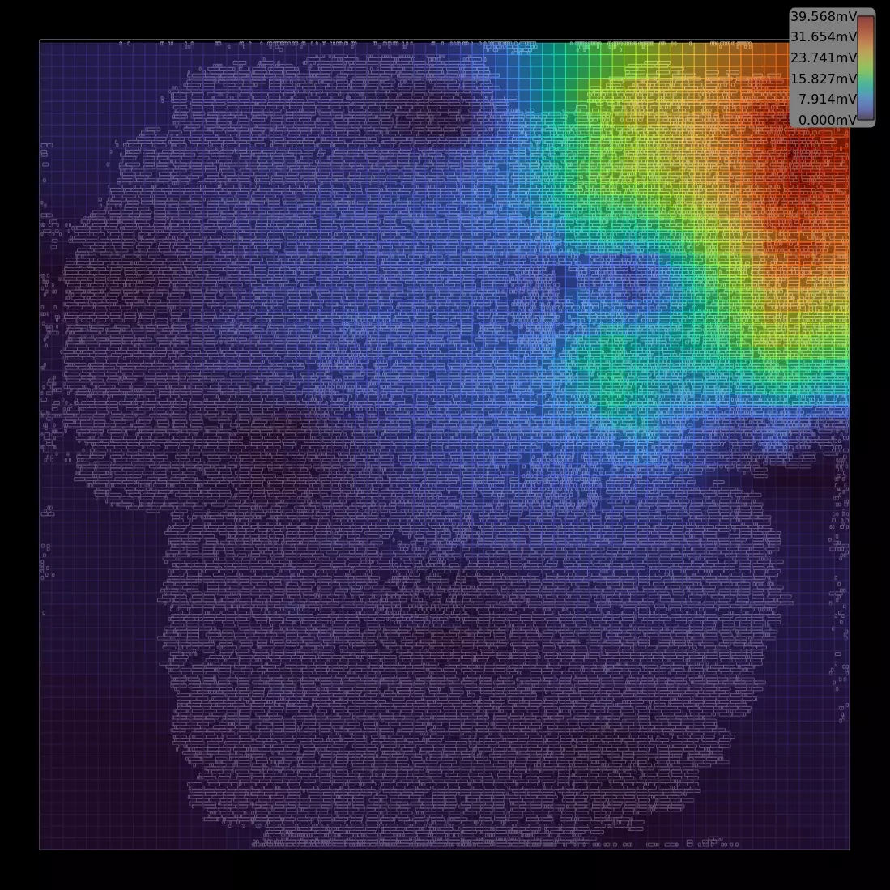  
*Figure 13: IR drop analysis showing voltage variations across the design*

## Future Work
- **Performance**: Investigate deeper unrolling and pipelining
- **Area**: Optimize placement and routing parameters
- **Validation**: Expand test coverage with additional vectors

## Conclusion
- Successfully developed a pipelined SHA-256 accelerator with major performance gains
- Final design: 270600 μm² area, 57% utilization
- Set the stage for future enhancements in performance and efficiency
